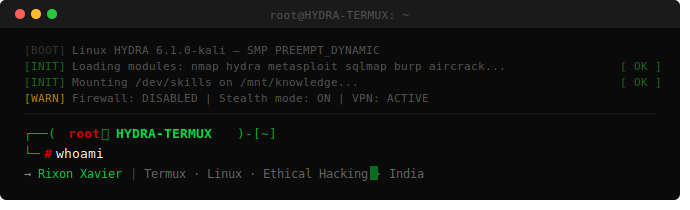

<div align="center">



[](https://github.com/HYDRA-TERMUX)

[](https://github.com/HYDRA-TERMUX)
[](https://github.com/HYDRA-TERMUX?tab=followers)

</div>

---

```
╔══════════════════════════════════════════════════════════════════════════╗
║  [BOOT] Linux HYDRA — SMP PREEMPT_DYNAMIC                              ║
║  [INIT] Loading: nmap hydra metasploit sqlmap burp aircrack john...    ║
║  [INIT] Mounting /dev/knowledge on /mnt/target...............  [ OK ]  ║
║  [WARN] Firewall: DISABLED  |  Stealth mode: ON                        ║
║  [ROOT] Shell spawned. You have 1 life. Use it wisely. 💀              ║
╚══════════════════════════════════════════════════════════════════════════╝
```

---

## `[01]` // OPERATOR PROFILE

```
┌──(root㉿HYDRA-TERMUX)-[~]
└─# cat /etc/operator

  ╔══════════════════════════════════════════════╗
  ║  CALLSIGN  ::  HYDRA-TERMUX                  ║
  ║  REALNAME  ::  Rixon Xavier                  ║
  ║  NODE      ::  India  [UTC +05:30]           ║
  ║  PLATFORM  ::  Android · Termux · Kali       ║
  ║  UPTIME    ::  Learning 24/7 · No Days Off   ║
  ╠══════════════════════════════════════════════╣
  ║  [+]  Termux Android Exploitation            ║
  ║  [+]  Python Payload Development             ║
  ║  [+]  Bash Automation & Scripting            ║
  ║  [+]  Network Recon & OSINT                  ║
  ║  [+]  Web App Pentesting (SQLi · XSS)        ║
  ║  [+]  CTF — Capture The Flag Challenges      ║
  ║  [+]  Open Source Tool Development           ║
  ╚══════════════════════════════════════════════╝
```

---

## `[02]` // WEAPON CACHE

```
┌──(root㉿HYDRA)-[~]
└─# dpkg -l | grep tools
```

<div align="center">

[](https://github.com/HYDRA-TERMUX)


</div>

---

## `[03]` // REPOSITORY ARSENAL

```
┌──(root㉿HYDRA)-[~]
└─# ls -lah ~/repos/
```

| REPO | DESCRIPTION | STARS |
|:-----|:------------|------:|
| [🚇 **Tunnel**](https://github.com/HYDRA-TERMUX/Tunnel) | Cloudflare tunnel for Termux | [](https://github.com/HYDRA-TERMUX/Tunnel) |
| [🐍 **Metahack**](https://github.com/HYDRA-TERMUX/Metahack) | Hacking tool for Termux | [](https://github.com/HYDRA-TERMUX/Metahack) |
| [📺 **tubegrab**](https://github.com/HYDRA-TERMUX/tubegrab) | YouTube video + MP3 downloader | [](https://github.com/HYDRA-TERMUX/tubegrab) |
| [🐧 **ubuntu-termux**](https://github.com/HYDRA-TERMUX/ubuntu-termux) | Ubuntu inside Termux | [](https://github.com/HYDRA-TERMUX/ubuntu-termux) |
| [🌐 **Ngrok-H**](https://github.com/HYDRA-TERMUX/Ngrok-H) | Ngrok automation helper | [](https://github.com/HYDRA-TERMUX/Ngrok-H) |
| [🎨 **Style**](https://github.com/HYDRA-TERMUX/Style) | UI & style experiments | [](https://github.com/HYDRA-TERMUX/Style) |

---

## `[04]` // SYSTEM DIAGNOSTICS

```
┌──(root㉿HYDRA)-[~]
└─# fetch --stats github.com/HYDRA-TERMUX
```

<div align="center">

[](https://github.com/HYDRA-TERMUX)

[](https://github.com/HYDRA-TERMUX)

[](https://github.com/HYDRA-TERMUX)
[](https://github.com/HYDRA-TERMUX)

</div>

---

## `[05]` // TROPHIES

```
┌──(root㉿HYDRA)-[~]
└─# hydra --list-achievements --verbose
```

<div align="center">

[](https://github.com/HYDRA-TERMUX)

</div>

---

## `[06]` // CONTRIBUTION SNAKE

<div align="center">


</div>

---

## `[07]` // C2 CHANNELS

```
┌──(root㉿HYDRA)-[~]
└─# netstat -tulnp | grep ESTABLISHED
```

<div align="center">

[](https://github.com/HYDRA-TERMUX)
[](https://youtube.com/@HYDRATERMUX)
[](https://t.me/hydratermux)
[](https://hydratermux.blogspot.com)
[](https://in.pinterest.com/rixonxavier135/)
[](https://whatsapp.com/channel/0029VbCG7YB7tkjCqpL6I83g)

</div>

---

<div align="center">

```
╔══════════════════════════════════════════════════════════════════════════╗
║   "The quieter you become, the more you are able to hear."             ║
║                                                     — Kali Linux       ║
║   [*] Every great hacker started as a noob who refused to quit.       ║
║   [+] Keep learning. Keep breaking (ethically). Keep building. 🔥     ║
╚══════════════════════════════════════════════════════════════════════════╝
```


</div>
