<!-- ██╗  ██╗██╗   ██╗██████╗ ██████╗  █████╗    ████████╗███████╗██████╗ ███╗   ███╗██╗   ██╗██╗  ██╗
     ██║  ██║╚██╗ ██╔╝██╔══██╗██╔══██╗██╔══██╗   ╚══██╔══╝██╔════╝██╔══██╗████╗ ████║██║   ██║╚██╗██╔╝
     ███████║ ╚████╔╝ ██║  ██║██████╔╝███████║      ██║   █████╗  ██████╔╝██╔████╔██║██║   ██║ ╚███╔╝
     ██╔══██║  ╚██╔╝  ██║  ██║██╔══██╗██╔══██║      ██║   ██╔══╝  ██╔══██╗██║╚██╔╝██║██║   ██║ ██╔██╗
     ██║  ██║   ██║   ██████╔╝██║  ██║██║  ██║      ██║   ███████╗██║  ██║██║ ╚═╝ ██║╚██████╔╝██╔╝ ██╗
     ╚═╝  ╚═╝   ╚═╝   ╚═════╝ ╚═╝  ╚═╝╚═╝  ╚═╝      ╚═╝   ╚══════╝╚═╝  ╚═╝╚═╝     ╚═╝ ╚═════╝ ╚═╝  ╚═╝ -->

<div align="center">

<!-- ╔══════════════════════════════════════════════════════════════════╗ -->
<!-- ║  BANNER: self-hosted SVG in /assets — 100% uptime guaranteed   ║ -->
<!-- ╚══════════════════════════════════════════════════════════════════╝ -->
[](https://github.com/HYDRA-TERMUX)

<!-- typing SVG — demolab.com dedicated server, not vercel public, highly reliable -->
[](https://github.com/HYDRA-TERMUX)

<br/>

<!-- shields.io — enterprise infra, never goes down -->


</div>

---

```
╔══════════════════════════════════════════════════════════════════════════════════════╗
║  [BOOT]  Linux HYDRA 6.1.0-kali9-amd64 #1 SMP PREEMPT_DYNAMIC                     ║
║  [INIT]  Loading kernel modules: nmap hydra metasploit sqlmap aircrack john...     ║
║  [INIT]  Mounting /dev/hacking on /mnt/target...                      [  OK  ]     ║
║  [INIT]  Starting NetworkManager...                                   [  OK  ]     ║
║  [INIT]  Starting ssh.service...                                      [  OK  ]     ║
║  [WARN]  Firewall disabled. Stealth mode: ON                                       ║
║  [ROOT]  Shell spawned. You have: 1 life. Use it wisely. 💀                        ║
╚══════════════════════════════════════════════════════════════════════════════════════╝
```

---

## `[01]` // OPERATOR PROFILE


```bash
┌──(root㉿HYDRA-TERMUX)-[~]
└─# cat /etc/operator

  ╔══════════════════════════════════════════════╗
  ║  CALLSIGN  ::  HYDRA-TERMUX                  ║
  ║  REALNAME  ::  Rixon Xavier                  ║
  ║  NODE      ::  India  [UTC +05:30]           ║
  ║  PLATFORM  ::  Android · Termux · Kali       ║
  ║  UPTIME    ::  Learning 24/7 · No Days Off   ║
  ╠══════════════════════════════════════════════╣
  ║  [+]  Termux Android Exploitation            ║
  ║  [+]  Python Payload Development             ║
  ║  [+]  Bash Automation & Scripting            ║
  ║  [+]  Network Recon & OSINT                  ║
  ║  [+]  Web App Pentesting (SQLi, XSS)         ║
  ║  [+]  CTF — Capture The Flag Challenges      ║
  ║  [+]  Open Source Tool Development           ║
  ╚══════════════════════════════════════════════╝

┌──(root㉿HYDRA-TERMUX)-[~]
└─# _
```

<br clear="both"/>

---

## `[02]` // WEAPON CACHE

<div align="center">

```
┌──(root㉿HYDRA)-[~]
└─# dpkg -l | grep -E "nmap|hydra|metasploit|sqlmap|burp|john|aircrack"
```

<!-- skillicons.dev — CDN-backed, rock solid -->
[](https://github.com/HYDRA-TERMUX)

<br/>

<!-- all shields.io — 100% uptime -->


</div>

---

## `[03]` // REPOSITORY ARSENAL

<div align="center">

```
┌──(root㉿HYDRA)-[~]
└─# ls -lah /opt/arsenal/ --color=always
```

</div>

> **⚡ Repo cards are now generated via GitHub Actions** (the `github-readme-stats.vercel.app` public server shut down Dec 2025). See setup instructions at the bottom of this README.

<div align="center">

<!-- Using direct GitHub repo link badges — shields.io, always works -->

| Repo | Lang | Stars | Status |
|------|------|-------|--------|
| [🐍 **Metahack**](https://github.com/HYDRA-TERMUX/Metahack) |  |  |  |
| [📺 **tubegrab**](https://github.com/HYDRA-TERMUX/tubegrab) |  |  |  |
| [🐧 **ubuntu-termux**](https://github.com/HYDRA-TERMUX/ubuntu-termux) |  |  |  |
| [🌐 **Ngrok-H**](https://github.com/HYDRA-TERMUX/Ngrok-H) |  |  |  |
| [🎨 **Style**](https://github.com/HYDRA-TERMUX/Style) |  |  |  |

</div>

---

## `[04]` // SYSTEM DIAGNOSTICS

<div align="center">

```
┌──(root㉿HYDRA)-[~]
└─# fetch --stats --format=card github.com/HYDRA-TERMUX
```

<!-- streak-stats.demolab.com — DenverCoder1's own dedicated server, NOT the broken vercel one -->
[](https://github.com/HYDRA-TERMUX)

<br/>

<!-- github-profile-summary-cards — separate project from readme-stats, still working -->
[](https://github.com/HYDRA-TERMUX)

<br/>

[](https://github.com/HYDRA-TERMUX)
[](https://github.com/HYDRA-TERMUX)

<br/>

[](https://github.com/HYDRA-TERMUX)
[](https://github.com/HYDRA-TERMUX)

</div>

---

## `[05]` // TROPHIES

<div align="center">

```
┌──(root㉿HYDRA)-[~]
└─# hydra --list-achievements --verbose
```

<!-- github-profile-trophy — separate service, still working -->
[](https://github.com/HYDRA-TERMUX)

</div>

---

## `[06]` // CONTRIBUTION SNAKE

<div align="center">

```
┌──(root㉿HYDRA)-[~]
└─# snake --consume-all-commits --stealth on --output animated.svg
```

<!-- platane/snk output — served from raw.githubusercontent.com, GitHub's own CDN -->
<picture>
  <source media="(prefers-color-scheme: dark)"
    srcset="https://raw.githubusercontent.com/platane/snk/output/github-contribution-grid-snake-dark.svg"/>
  <source media="(prefers-color-scheme: light)"
    srcset="https://raw.githubusercontent.com/platane/snk/output/github-contribution-grid-snake.svg"/>
  
</picture>

> 💡 Add [platane/snk](https://github.com/platane/snk) GitHub Action to your profile repo to activate this.

</div>

---

## `[07]` // INTEL FEEDS

```
┌──(root㉿HYDRA)-[~]
└─# tail -f /var/log/hydra-termux/broadcasts.log
```

<table>
<tr>
<td width="50%" valign="top">

### 📝 Latest Blog Posts
**[hydratermux.blogspot.com](https://hydratermux.blogspot.com)**
```
[2025-03-01]  Termux Full Setup for Hacking
[2025-02-18]  Top Recon Tools for Android
[2025-02-05]  My Noob→Pro Hacking Journey
[2025-01-20]  Python Rev Shell in 10 Lines
[2025-01-07]  Ubuntu on Termux — Full Guide
```

</td>
<td width="50%" valign="top">

### 🎥 YouTube Channel
**[youtube.com/@HYDRATERMUX](https://youtube.com/@HYDRATERMUX)**
```
[NEW]  Termux Complete Setup 2025
[HOT]  Top 10 Hacking Tools Android
[VID]  Metasploit on Termux Explained
[VID]  Linux Basics for Hackers
[VID]  How I Got Into Ethical Hacking
```

</td>
</tr>
</table>

---

## `[08]` // C2 INFRASTRUCTURE

<div align="center">

```
┌──(root㉿HYDRA)-[~]
└─# netstat -tulnp | grep ESTABLISHED
```

<br/>

[](https://github.com/HYDRA-TERMUX)
[](https://youtube.com/@HYDRATERMUX)
[](https://t.me/hydratermux)
[](https://hydratermux.blogspot.com)
[](https://in.pinterest.com/rixonxavier135/)

</div>

---

<div align="center">

```
╔══════════════════════════════════════════════════════════════════════════════════╗
║                                                                                  ║
║   "The quieter you become, the more you are able to hear."  — Kali Linux        ║
║                                                                                  ║
║   [*] Every expert was once a noob who refused to quit.                         ║
║   [+] Keep learning. Keep breaking (ethically). Keep building. 🔥               ║
║                                                                                  ║
╚══════════════════════════════════════════════════════════════════════════════════╝
```

[](https://github.com/HYDRA-TERMUX)


</div>

---

<details>
<summary><code>[SETUP INSTRUCTIONS — click to expand]</code></summary>

### 🛠 How to deploy this README perfectly

**Step 1 — Create your profile repo**
```bash
# Create a repo named exactly: HYDRA-TERMUX
# (same as your GitHub username — this is the special profile repo)
```

**Step 2 — Add the banner SVG**
```bash
mkdir assets
cp banner.svg assets/banner.svg
git add assets/banner.svg
```

**Step 3 — Enable the Contribution Snake**
> Create `.github/workflows/snake.yml`:
```yaml
name: Generate Snake
on:
  schedule: [{cron: "0 0 * * *"}]
  workflow_dispatch:
jobs:
  snake:
    runs-on: ubuntu-latest
    steps:
      - uses: Platane/snk@v3
        with:
          github_user_name: HYDRA-TERMUX
          outputs: |
            dist/github-contribution-grid-snake.svg
            dist/github-contribution-grid-snake-dark.svg?palette=github-dark
      - uses: crazy-max/ghaction-github-pages@v3
        with:
          target_branch: output
          build_dir: dist
        env:
          GITHUB_TOKEN: ${{ secrets.GITHUB_TOKEN }}
```

**Step 4 — Commit everything**
```bash
git add README.md assets/ .github/
git commit -m "feat: 🐍 hacker profile README"
git push origin main
```

**Why some widgets use alternative services:**
| Widget | Old (broken) | New (working) |
|--------|-------------|---------------|
| Stats card | `github-readme-stats.vercel.app` ❌ | `github-profile-summary-cards.vercel.app` ✅ |
| Streak | `streak-stats.demolab.com` | Same — still works ✅ |
| Repo pins | `github-readme-stats.vercel.app` ❌ | `shields.io` badges table ✅ |
| Trophies | `github-profile-trophy.vercel.app` | Same — still works ✅ |

</details>